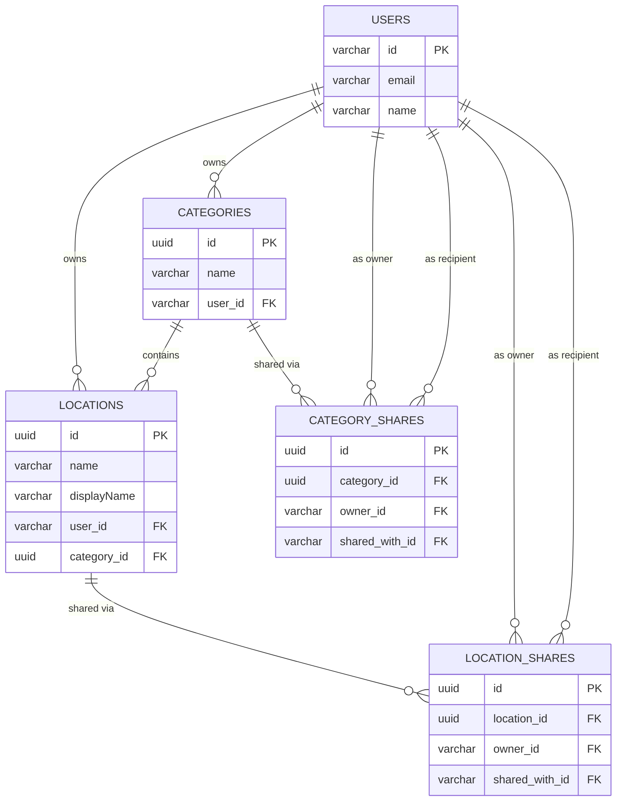

# Locify Database Schema

This document defines the relational database schema used in the Locify backend, built with PostgreSQL. It supports user-based location management, category grouping for saving planned or memorable locations, and sharing of categories and locations with multiple users. Offline synchronization and cross-device consistency are managed using `sync_status` and `updated_at`.

---

## Table of Contents
- [Validation Notes](#validation-notes)
- [Users Table](#users-table)
- [Categories Table](#categories-table)
- [Locations Table](#locations-table)
- [Category Shares Table](#category-shares-table)
- [Location Shares Table](#location-shares-table)
- [Sync Status Values](#sync-status-values)
- [Relationship Diagram](#relationship-diagram)
- [Related Documentation](#related-documentation)

---

## Validation Notes
This schema defines basic database constraints, including data types, `NOT NULL`, `UNIQUE`, maximum lengths, and foreign key relationships. Additional validation rules (e.g., email format, special characters in `name` or `displayName`, valid `sync_status` values, valid `role` values) are enforced at the API layer and documented in the [API Documentation](../docs/Locify_API_Documentation.md).

**Image Cleanup**:
- During user deletion (via `DELETE /users/me`), the backend queries the `categories` table for `icon` URLs, the `locations` table for `image_urls`, and the `users` table for `avatar_url` associated with the `user_id`. These images are deleted from Firebase Storage using the Firebase Admin SDK before removing database records.
- The deletion process uses transactions in PostgreSQL to ensure data integrity, with image deletions from Firebase Storage performed first to prevent orphaned data.
- When a `category` or `location` is deleted, associated records in `category_shares` or `location_shares` are also deleted.

---

## Users Table
Stores information about registered users, synchronized with Firebase Authentication.

| Column Name  | Data Type    | Constraints                       | Description                         |
|--------------|--------------|-----------------------------------|-------------------------------------|
| `id`         | VARCHAR(128) | PRIMARY KEY                       | Unique user ID (Firebase UID)       |
| `email`      | VARCHAR(255) | UNIQUE, NOT NULL                  | Unique email address                |
| `name`       | VARCHAR(255) | NOT NULL                          | Full name of the user               |
| `avatar_url` | VARCHAR(255) |                                   | URL of the user's profile image     |
| `created_at` | TIMESTAMP    |                                   | Time of account creation            |
| `updated_at` | TIMESTAMP    |                                   | Last time the user info was updated |

---

## Categories Table
Stores user-defined or default categories for organizing locations, including a default "Shared Places" category for shared locations.

| Column Name   | Data Type           | Constraints                                     | Description                                     |
|---------------|---------------------|-------------------------------------------------|-------------------------------------------------|
| `id`          | UUID                | PRIMARY KEY                                     | Unique category ID                              |
| `user_id`     | VARCHAR(128)        | FOREIGN KEY (users.id), NOT NULL                | References `users(id)`                          |
| `name`        | VARCHAR(255)        | NOT NULL                                        | Name of the category                            |
| `icon`        | VARCHAR(255)        |                                                 | URL of the category icon                        |
| `visibility`  | ENUM('private', 'shared', 'public') | DEFAULT 'private'                     | Access level: private, shared, public           |
| `is_default`  | BOOLEAN             | DEFAULT FALSE                                   | Marks default category (e.g., Shared Places)    |
| `sync_status` | ENUM('synced', 'pendingCreate', 'pendingUpdate', 'pendingDelete') | NOT NULL | Synchronization status                           |
| `created_at`  | TIMESTAMP           |                                                 | Time of category creation                       |
| `updated_at`  | TIMESTAMP           |                                                 | Last time the category was updated              |

**Indexes**:
- `idx_categories_user_id`: Optimizes queries for user-specific categories, including image cleanup during user deletion.

**Relations**:
- Belongs to one `user`
- Has many `locations`
- Has many `category_shares`

---

## Locations Table
Stores all location information saved by the user, including shared locations. The `displayName` field stores the custom name input by the user, while `name` stores the official or resolved location name (e.g., from Google Maps).

| Column Name   | Data Type           | Constraints                                     | Description                                      |
|---------------|---------------------|-------------------------------------------------|--------------------------------------------------|
| `id`          | UUID                | PRIMARY KEY                                     | Unique location ID                               |
| `user_id`     | VARCHAR(128)        | FOREIGN KEY (users.id), NOT NULL                | References `users(id)`                           |
| `category_id` | UUID                | FOREIGN KEY (categories.id), NOT NULL           | References `categories(id)`                      |
| `name`        | VARCHAR(255)        | NOT NULL                                        | Official or resolved name of the location        |
| `displayName`| VARCHAR(255)        | NOT NULL                                        | Custom name input by the user                    |
| `address`     | TEXT                |                                                 | Address of the location (e.g., "123 Main St")    |
| `description` | TEXT                |                                                 | Optional description of the location             |
| `latitude`    | DOUBLE PRECISION    | NOT NULL                                        | Latitude coordinate (between -90 and 90)         |
| `longitude`   | DOUBLE PRECISION    | NOT NULL                                        | Longitude coordinate (between -180 and 180)      |
| `is_favorite` | BOOLEAN             | DEFAULT FALSE                                   | Whether the location is marked as a favorite      |
| `image_urls`  | TEXT[]              |                                                 | Array of URLs for location images                |
| `notes`       | TEXT                |                                                 | Detailed notes about the location                |
| `tags`        | TEXT[]              |                                                 | Array of custom tags                             |
| `visibility`  | ENUM('private', 'shared', 'public') | DEFAULT 'private'                     | Access level: private, shared, public           |
| `sync_status` | ENUM('synced', 'pendingCreate', 'pendingUpdate', 'pendingDelete') | NOT NULL | Synchronization status                           |
| `created_at`  | TIMESTAMP           |                                                 | Time of location creation                        |
| `updated_at`  | TIMESTAMP           |                                                 | Last time the location was updated               |

**Indexes**:
- `idx_locations_category_id`: Optimizes queries for category-specific locations.
- `idx_locations_user_id`: Optimizes queries for user-specific locations, including image cleanup during user deletion.
- `idx_locations_tags`: Optimizes search and filtering by tags.

**Relations**:
- Belongs to one `user`
- Belongs to one `category`
- Has many `location_shares`

---

## Category Shares Table
Stores information about shared categories, including the role of each user.

| Column Name     | Data Type           | Constraints                                     | Description                                      |
|-----------------|---------------------|-------------------------------------------------|--------------------------------------------------|
| `id`            | UUID                | PRIMARY KEY                                     | Unique ID for the share record                   |
| `category_id`   | UUID                | FOREIGN KEY (categories.id), NOT NULL           | References `categories(id)`                      |
| `owner_id`      | VARCHAR(128)        | FOREIGN KEY (users.id), NOT NULL                | ID of the owner (sharer)                         |
| `shared_with_id`| VARCHAR(128)        | FOREIGN KEY (users.id), NOT NULL                | ID of the user shared with                       |
| `role`          | ENUM('read', 'edit', 'owner') | NOT NULL                      | Role: read, edit, or owner                       |
| `created_at`    | TIMESTAMP           |                                                 | Time of share creation                           |
| `updated_at`    | TIMESTAMP           |                                                 | Last time the share was updated                  |

**Indexes**:
- `idx_category_shares_category_id`: Optimizes queries for category-specific shares.
- `idx_category_shares_shared_with_id`: Optimizes queries for shares received by a user.

**Relations**:
- Belongs to one `category`
- Belongs to one `user` (owner)
- Belongs to one `user` (shared_with)

---

## Location Shares Table
Stores information about shared locations, including the role of each user.

| Column Name     | Data Type           | Constraints                                     | Description                                      |
|-----------------|---------------------|-------------------------------------------------|--------------------------------------------------|
| `id`            | UUID                | PRIMARY KEY                                     | Unique ID for the share record                   |
| `location_id`   | UUID                | FOREIGN KEY (locations.id), NOT NULL            | References `locations(id)`                       |
| `owner_id`      | VARCHAR(128)        | FOREIGN KEY (users.id), NOT NULL                | ID of the owner (sharer)                         |
| `shared_with_id`| VARCHAR(128)        | FOREIGN KEY (users.id), NOT NULL                | ID of the user shared with                       |
| `role`          | ENUM('read', 'edit', 'owner') | NOT NULL                      | Role: read, edit, or owner                       |
| `created_at`    | TIMESTAMP           |                                                 | Time of share creation                           |
| `updated_at`    | TIMESTAMP           |                                                 | Last time the share was updated                  |

**Indexes**:
- `idx_location_shares_location_id`: Optimizes queries for location-specific shares.
- `idx_location_shares_shared_with_id`: Optimizes queries for shares received by a user.

**Relations**:
- Belongs to one `location`
- Belongs to one `user` (owner)
- Belongs to one `user` (shared_with)

---

## Sync Status Values
Values for `sync_status` used in `categories` and `locations`:
- `synced`: Synced with the server
- `pendingCreate`: Created locally, not yet sent to server
- `pendingUpdate`: Updated locally, not yet synced
- `pendingDelete`: Deleted locally, pending sync

---

## Relationship Diagram
The diagram below illustrates the relationships between the `users`, `categories`, `locations`, `category_shares`, and `location_shares` tables:
- Each `user` **owns multiple** `categories` and `locations`, indicated by the `user_id` foreign key.
- Each `category` **can include multiple** `locations`, indicated by the `category_id` foreign key.
- Each `location` **belongs to one** `category` and **one** `user`.
- Each `category` **can be shared with multiple** `users` via `category_shares`.
- Each `location` **can be shared with multiple** `users` via `location_shares`.

---

[Back to Project Overview](../README.md)
