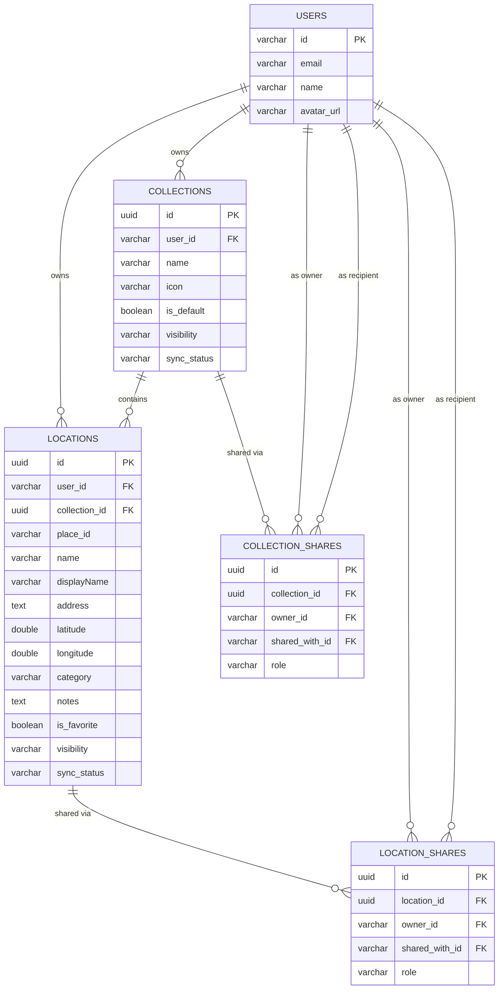

# Locify Database Schema

This document defines the relational database schema used in the Locify backend, built with PostgreSQL. It supports user-based location management, collection grouping for saving planned or memorable locations, and sharing of collections and locations with multiple users. Offline synchronization and cross-device consistency are managed using `sync_status` and `updated_at`.

---

## Table of Contents
- [Validation Notes](#validation-notes)
- [Users Table](#users-table)
- [Collections Table](#collections-table)
- [Locations Table](#locations-table)
- [Collection Shares Table](#collection-shares-table)
- [Location Shares Table](#location-shares-table)
- [Sync Status Values](#sync-status-values)
- [Relationship Diagram](#relationship-diagram)
- [Related Documentation](#related-documentation)

---

## Validation Notes
This schema defines basic database constraints, including data types, `NOT NULL`, `UNIQUE`, maximum lengths, and foreign key relationships. Additional validation rules (e.g., email format, special characters in `name` or `displayName`, valid `sync_status` values, valid `role` values, valid `visibility` values, and optional fields like `place_id`/`category`) are enforced at the API layer and documented in the [API Documentation](../docs/Locify_API_Documentation.md).

**Image Cleanup**:
- During user deletion (via `DELETE /users/me`), the backend queries the `collections` table for `icon` URLs, the `locations` table for `image_urls`, and the `users` table for `avatar_url` associated with the `user_id`. These images are deleted from Firebase Storage using the Firebase Admin SDK before removing database records.
- The deletion process uses transactions in PostgreSQL to ensure data integrity, with image deletions from Firebase Storage performed first to prevent orphaned data.
- When a `collection` or `location` is deleted, associated records in `collection_shares` or `location_shares` are also deleted.

---

## Users Table
Stores information about registered users, synchronized with Firebase Authentication.

| Column Name  | Data Type    | Constraints                       | Description                         |
|--------------|--------------|-----------------------------------|-------------------------------------|
| `id`         | VARCHAR(128) | PRIMARY KEY                       | Unique user ID (Firebase UID)       |
| `email`      | VARCHAR(255) | UNIQUE, NOT NULL                  | Unique email address                |
| `name`       | VARCHAR(255) | NOT NULL                          | Full name of the user               |
| `avatar_url` | VARCHAR(255) |                                   | URL of the user's profile image     |
| `created_at` | TIMESTAMP    |                                   | Time of account creation            |
| `updated_at` | TIMESTAMP    |                                   | Last time the user info was updated |

---

## Collections Table
Stores user-defined or default collections for organizing locations, including a default "Shared Places" collection for shared locations.

| Column Name   | Data Type           | Constraints                                     | Description                                     |
|---------------|---------------------|-------------------------------------------------|-------------------------------------------------|
| `id`          | UUID                | PRIMARY KEY                                     | Unique collection ID                              |
| `user_id`     | VARCHAR(128)        | FOREIGN KEY (users.id), NOT NULL                | References `users(id)`                          |
| `name`        | VARCHAR(255)        | NOT NULL                                        | Name of the collection                            |
| `icon`        | VARCHAR(255)        |                                                 | URL of the collection icon                        |
| `visibility`  | ENUM('private', 'shared') | DEFAULT 'private'                     | Access level: private, shared           |
| `is_default`  | BOOLEAN             | DEFAULT FALSE                                   | Marks default collection (e.g., Shared Places)    |
| `sync_status` | ENUM('synced', 'pendingCreate', 'pendingUpdate', 'pendingDelete') | NOT NULL | Synchronization status                           |
| `created_at`  | TIMESTAMP           |                                                 | Time of collection creation                       |
| `updated_at`  | TIMESTAMP           |                                                 | Last time the collection was updated              |

**Indexes**:
- `idx_collections_user_id`: Optimizes queries for user-specific collections, including image cleanup during user deletion.

**Relations**:
- Belongs to one `user`
- Has many `locations`
- Has many `collection_shares`

**API response projection**:
- `CollectionResponse.share` is not a DB column; it is computed from `collection_shares` + `users` (and ownership from `collections.user_id`). It includes the authenticated user’s `role` and a `permissions` list.

---

## Locations Table
Stores all location information saved by the user, including shared locations. The `displayName` field stores the custom name input by the user, while `name` stores the official or resolved location name.

| Column Name      | Data Type        | Constraints                                      | Description                                              |
|-----------------|------------------|--------------------------------------------------|----------------------------------------------------------|
| `id`            | UUID             | PRIMARY KEY                                      | Unique location ID                                       |
| `user_id`       | VARCHAR(128)     | FOREIGN KEY (users.id), NOT NULL                 | References `users(id)`                                   |
| `collection_id` | UUID             | FOREIGN KEY (collections.id), NOT NULL           | References `collections(id)`                              |
| `place_id`      | VARCHAR(255)     |                                                  | Optional external place ID (e.g., Google Place ID)       |
| `name`          | VARCHAR(255)     | NOT NULL                                         | Official or resolved name of the location                |
| `displayName`   | VARCHAR(255)     | NOT NULL                                         | Custom name input by the user (API key: `displayName`)   |
| `address`       | TEXT             |                                                  | Address of the location                                  |
| `latitude`      | DOUBLE PRECISION | NOT NULL                                         | Latitude coordinate (between -90 and 90)                 |
| `longitude`     | DOUBLE PRECISION | NOT NULL                                         | Longitude coordinate (between -180 and 180)              |
| `category`      | VARCHAR(255)     |                                                  | Optional category string                                 |
| `notes`         | TEXT             |                                                  | Optional notes                                           |
| `image_urls`    | TEXT[]           |                                                  | Array of URLs for location images                        |
| `tags`          | TEXT[]           |                                                  | Array of custom tags                                     |
| `is_favorite`   | BOOLEAN          | DEFAULT FALSE                                    | Whether the location is marked as a favorite             |
| `visibility`    | ENUM('private', 'shared') | DEFAULT 'private'              | Access level: private, shared                    |
| `sync_status`   | ENUM('synced', 'pendingCreate', 'pendingUpdate', 'pendingDelete') | NOT NULL | Synchronization status                          |
| `created_at`    | TIMESTAMP        |                                                  | Time of location creation                                |
| `updated_at`    | TIMESTAMP        |                                                  | Last time the location was updated                       |

**Indexes**:
- `idx_locations_collection_id`: Optimizes queries for collection-specific locations.
- `idx_locations_user_id`: Optimizes queries for user-specific locations, including image cleanup during user deletion.
- `idx_locations_tags`: Optimizes search and filtering by tags.

**Relations**:
- Belongs to one `user`
- Belongs to one `collection`
- Has many `location_shares`
- When a collection is deleted, the backend manually deletes all associated
  locations (and their images) before deleting the collection record, to handle
  the foreign key constraint on `collection_id`.

**API response projection**:
- `LocationResponse.share` is not a DB column; it is computed from `location_shares` + `users` (and ownership from `locations.user_id`). It includes the authenticated user’s `role` and a `permissions` list.

---

## Collection Shares Table
Stores information about shared collections, including the role of each user.

| Column Name       | Data Type           | Constraints                                     | Description                                      |
|------------------|---------------------|-------------------------------------------------|--------------------------------------------------|
| `id`             | UUID                | PRIMARY KEY                                     | Unique ID for the share record                   |
| `collection_id`  | UUID                | FOREIGN KEY (collections.id), NOT NULL          | References `collections(id)`                     |
| `owner_id`       | VARCHAR(128)        | FOREIGN KEY (users.id), NOT NULL                | ID of the owner (sharer)                         |
| `shared_with_id` | VARCHAR(128)        | FOREIGN KEY (users.id), NOT NULL                | ID of the user shared with                       |
| `role`           | ENUM('read', 'edit') | NOT NULL                              | Role: read, edit                       |
| `created_at`     | TIMESTAMP           |                                                 | Time of share creation                           |
| `updated_at`     | TIMESTAMP           |                                                 | Last time the share was updated                  |

**Indexes**:
- `idx_collection_shares_collection_id`: Optimizes queries for collection-specific shares.
- `idx_collection_shares_shared_with_id`: Optimizes queries for shares received by a user.

**Relations**:
- Belongs to one `collection`
- Belongs to one `user` (owner)
- Belongs to one `user` (shared_with)

**How this maps to API (`ShareResponse`)**:
- `ShareResponse.role`: role of the authenticated user for this collection.
  - If `auth_user_id == collections.user_id` => `owner`.
  - Else resolve from `collection_shares.role` for that `auth_user_id`.
- `ShareResponse.permissions[]`: includes the owner plus all shared users (deduplicated).
  - Owner permission is derived from the parent table (not from `collection_shares`):
    - `permissions[].user_id` -> `collections.user_id`
    - `permissions[].role`    -> `owner`
    - `permissions[].name`    -> `users.name`
    - `permissions[].email`   -> `users.email`
    - `permissions[].user_image_url` -> `users.avatar_url`
  - Shared permissions are derived by joining share records with `users`:
    - `permissions[].user_id` -> `collection_shares.shared_with_id`
    - `permissions[].role`    -> `collection_shares.role`
    - `permissions[].name`    -> `users.name`
    - `permissions[].email`   -> `users.email`
    - `permissions[].user_image_url` -> `users.avatar_url`

---

## Location Shares Table
Stores information about shared locations, including the role of each user.

| Column Name       | Data Type           | Constraints                                     | Description                                      |
|------------------|---------------------|-------------------------------------------------|--------------------------------------------------|
| `id`             | UUID                | PRIMARY KEY                                     | Unique ID for the share record                   |
| `location_id`    | UUID                | FOREIGN KEY (locations.id), NOT NULL            | References `locations(id)`                       |
| `owner_id`       | VARCHAR(128)        | FOREIGN KEY (users.id), NOT NULL                | ID of the owner (sharer)                         |
| `shared_with_id` | VARCHAR(128)        | FOREIGN KEY (users.id), NOT NULL                | ID of the user shared with                       |
| `role`           | ENUM('read', 'edit') | NOT NULL                              | Role: read, edit                       |
| `created_at`     | TIMESTAMP           |                                                 | Time of share creation                           |
| `updated_at`     | TIMESTAMP           |                                                 | Last time the share was updated                  |

**Indexes**:
- `idx_location_shares_location_id`: Optimizes queries for location-specific shares.
- `idx_location_shares_shared_with_id`: Optimizes queries for shares received by a user.

**Relations**:
- Belongs to one `location`
- Belongs to one `user` (owner)
- Belongs to one `user` (shared_with)

**How this maps to API (`ShareResponse`)**:
- `ShareResponse.role`: role of the authenticated user for this location.
  - If `auth_user_id == locations.user_id` => `owner`.
  - Else resolve from `location_shares.role` for that `auth_user_id`.
- `ShareResponse.permissions[]`: includes the owner plus all shared users (deduplicated).
  - Owner permission is derived from the parent table (not from `location_shares`):
    - `permissions[].user_id` -> `locations.user_id`
    - `permissions[].role`    -> `owner`
    - `permissions[].name`    -> `users.name`
    - `permissions[].email`   -> `users.email`
    - `permissions[].user_image_url` -> `users.avatar_url`
  - Shared permissions are derived by joining share records with `users`:
    - `permissions[].user_id` -> `location_shares.shared_with_id`
    - `permissions[].role`    -> `location_shares.role`
    - `permissions[].name`    -> `users.name`
    - `permissions[].email`   -> `users.email`
    - `permissions[].user_image_url` -> `users.avatar_url`

---

## Sync Status Values
Values for `sync_status` used in `collections` and `locations`:
- `synced`: Synced with the server
- `pendingCreate`: Created locally, not yet sent to server
- `pendingUpdate`: Updated locally, not yet synced
- `pendingDelete`: Deleted locally, pending sync

---

## Relationship Diagram
The diagram below illustrates the relationships between the `users`, `collections`, `locations`, `collection_shares`, and `location_shares` tables:
- Each `user` **owns multiple** `collections` and `locations`, indicated by the `user_id` foreign key.
- Each `collection` **can include multiple** `locations`, indicated by the `collection_id` foreign key.
- Each `location` **belongs to one** `collection` and **one** `user`.
- Each `collection` **can be shared with multiple** `users` via `collection_shares`.
- Each `location` **can be shared with multiple** `users` via `location_shares`.

```mermaid
erDiagram
    USERS {
        varchar id PK
        varchar email
        varchar name
        varchar avatar_url
    }

    COLLECTIONS {
        uuid id PK
        varchar user_id FK
        varchar name
        varchar icon
        boolean is_default
        varchar visibility
        varchar sync_status
    }

    LOCATIONS {
        uuid id PK
        varchar user_id FK
        uuid collection_id FK
        varchar place_id
        varchar name
        varchar displayName
        text address
        double latitude
        double longitude
        varchar category
        text notes
        boolean is_favorite
        varchar visibility
        varchar sync_status
    }

    COLLECTION_SHARES {
        uuid id PK
        uuid collection_id FK
        varchar owner_id FK
        varchar shared_with_id FK
        varchar role
    }

    LOCATION_SHARES {
        uuid id PK
        uuid location_id FK
        varchar owner_id FK
        varchar shared_with_id FK
        varchar role
    }

    %% Core ownership
    USERS ||--o{ COLLECTIONS : "owns"
    USERS ||--o{ LOCATIONS : "owns"
    COLLECTIONS ||--o{ LOCATIONS : "contains"

    %% Collection shares
    COLLECTIONS ||--o{ COLLECTION_SHARES : "shared via"
    USERS ||--o{ COLLECTION_SHARES : "as owner"
    USERS ||--o{ COLLECTION_SHARES : "as recipient"

    %% Location shares
    LOCATIONS ||--o{ LOCATION_SHARES : "shared via"
    USERS ||--o{ LOCATION_SHARES : "as owner"
    USERS ||--o{ LOCATION_SHARES : "as recipient"
```

---

## Related Documentation
- [Locify API Documentation](../docs/Locify_API_Documentation.md)
- [Locify Data Sync Flow](../docs/Locify_Data_Sync_Flow.md)
- [Locify System Architecture](../docs/Locify_System_Architecture.md)

---

[Back to Project Overview](../README.md)
