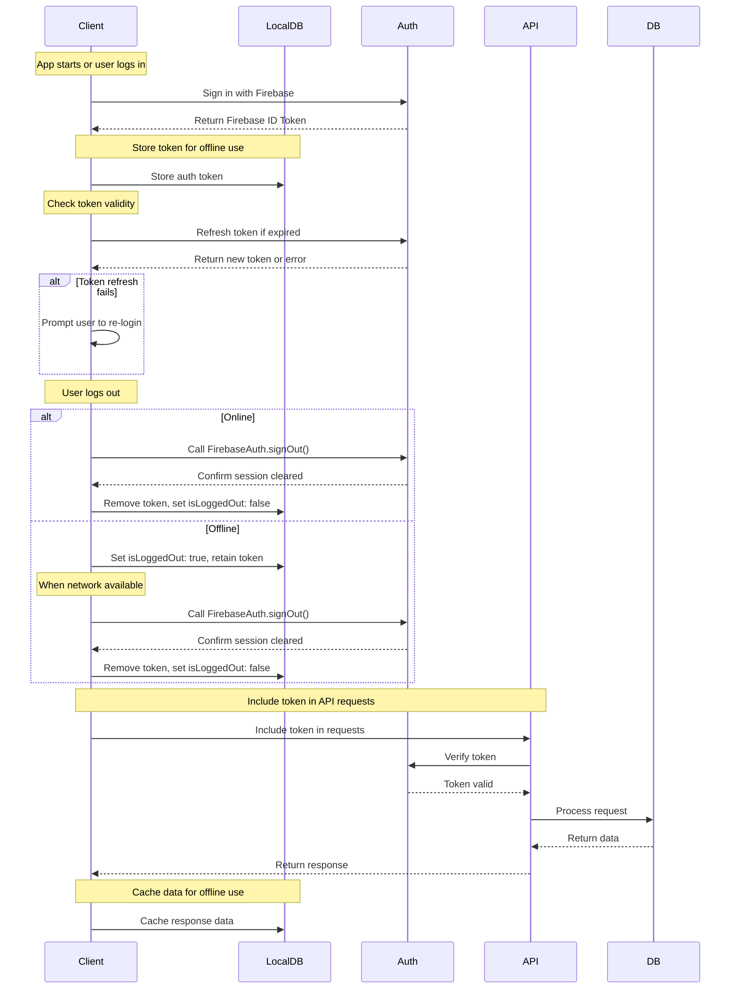
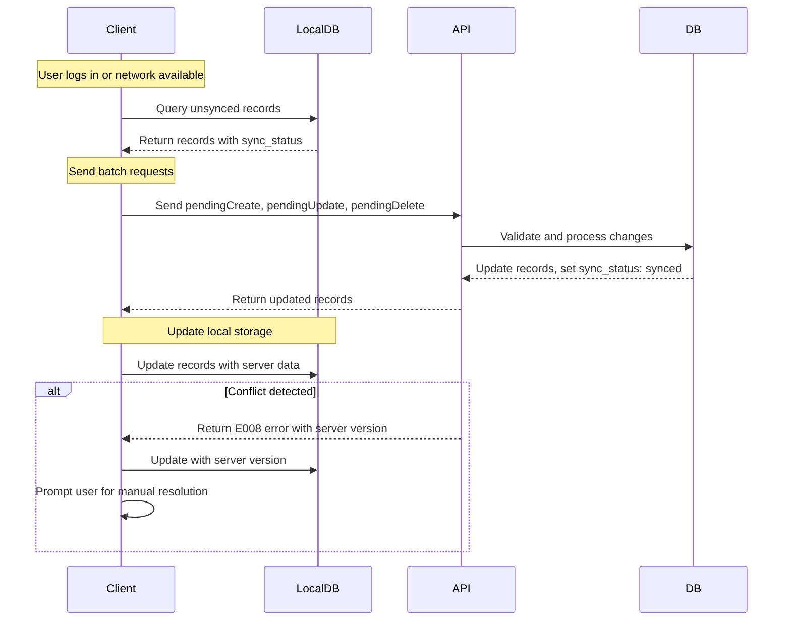
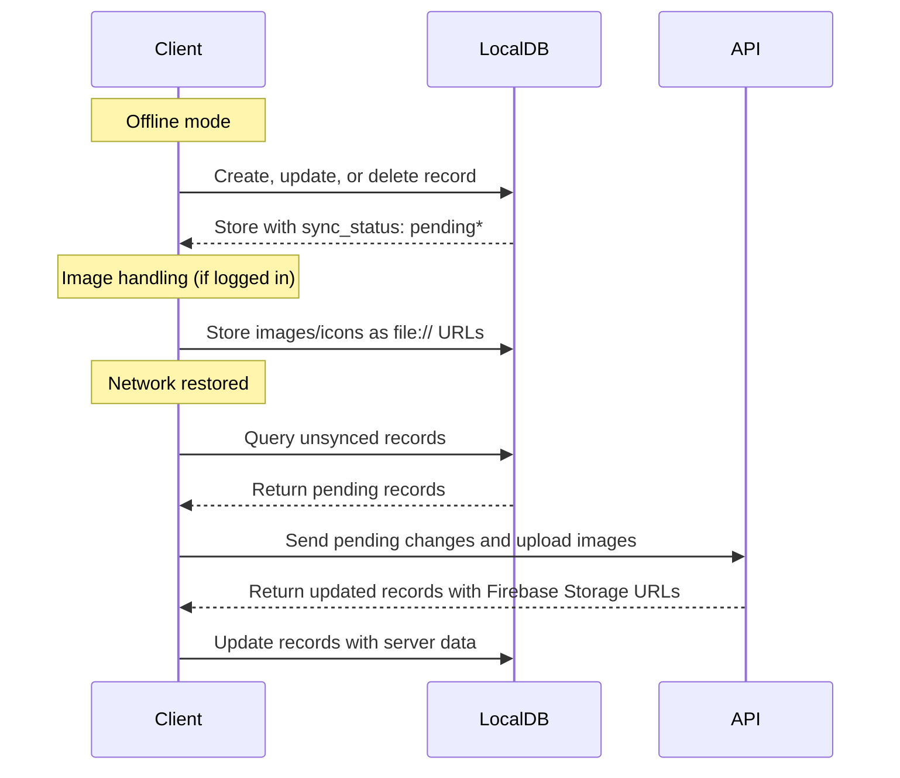
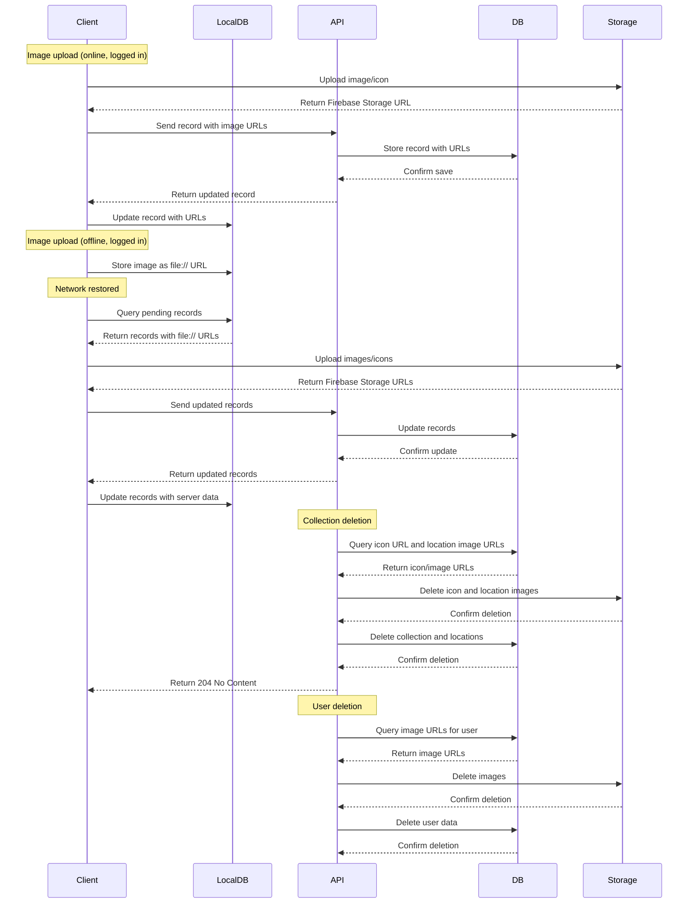

# System Architecture for the "Locify" Application

**Objective**: Outline the high-level system architecture for the Locify application, detailing the components, their interactions, and data flow to support online and offline functionality for saving and managing locations.

---

## Table of Contents
- [System Overview](#system-overview)
- [Components](#components)
- [Data Flow](#data-flow)
  - [1. Authentication Flow](#1-authentication-flow)
  - [2. Data Synchronization Flow](#2-data-synchronization-flow)
  - [3. Offline Support Flow](#3-offline-support-flow)
  - [4. Image Handling Flow](#4-image-handling-flow)
- [Diagrams](#diagrams)

---

## System Overview
Locify is a cross-platform application (iOS, Android, and backend) designed to allow users to save and manage locations, supporting both online and offline modes. The system uses a client-server architecture with Firebase for authentication and storage, a PostgreSQL database for structured data, and local storage for offline support. The backend is built with Java/Spring Boot, while both the iOS and Android apps use Swift and Kotlin, respectively, with Google Maps SDK for map functionalities.

Key features:
- **Online/Offline Support**: Users can save, edit, and delete locations and collections offline, with data syncing when online.
- **Authentication**: Firebase Authentication manages user sessions, with offline login support using cached credentials.
- **Data Synchronization**: Local data syncs with the server upon login or network availability, handling conflicts and batch processing.
- **Image Handling**: Images are stored in Firebase Storage by the client, with temporary local storage for offline use. The backend deletes images during user account deletion to clean up storage.

---

## Components
1. **Client Applications**:
   - **iOS App**: Built with Swift, using Google Maps SDK for maps and Firebase SDK for authentication/storage.
   - **Android App**: Built with Kotlin, using Google Maps SDK and Firebase SDK.
   - **Local Storage**: SwiftData (iOS) and Room (Android) for caching data and supporting offline operations.
2. **Backend Service**:
   - **Java/Spring Boot**: Handles API requests, business logic, database interactions, and image deletion in Firebase Storage during user deletion.
   - **PostgreSQL**: Stores structured data (users, locations, collections).
   - **Firebase Authentication**: Manages user authentication and token verification.
   - **Firebase Storage**: Stores images and collection icons, managed by clients for uploads and by the backend for deletions.
3. **External Services**:
   - **Google Maps SDK**: Provides map rendering, search, and navigation for both iOS and Android.

---

## Data Flow

### 1. Authentication Flow

**Key Points**:
- Firebase ID Token is stored locally for offline use and refreshed automatically when online.
- Offline logout sets `isLoggedOut: true` and defers `FirebaseAuth.signOut()` until network is available.
- API requests include the Firebase token, verified by the backend using Firebase Authentication.

### 2. Data Synchronization Flow

**Key Points**:
- Synchronization occurs after login, when network connectivity is restored, or manually triggered by the user.
- The client sends batch requests (up to 50 records) with `sync_status: pendingCreate`, `pendingUpdate`, or `pendingDelete`.
- The server uses `updated_at` to resolve conflicts, rejecting older changes with an `E008` error.
- Synced records are updated in local storage with `sync_status: synced`.

### 3. Offline Support Flow

**Key Points**:
- Offline operations are stored in local storage (SwiftData for iOS, Room for Android) with appropriate `sync_status`.
- Images/icons, when logged in, are stored locally as `file://` URLs and uploaded to Firebase Storage when online.
- Changes are synced with the server when network connectivity is restored.

### 4. Image Handling Flow

**Key Points**:
- Image selection is only available when the user is logged in; otherwise, a message is displayed: "Please log in to add or remove images."
- When logged in, images are uploaded to Firebase Storage by the client when online or stored locally (e.g., `file://`) when offline.
- Image URLs are updated in local storage and synced with the server.
- Offline images are marked as pending upload and processed when online.
- For individual image deletions (e.g., editing location/collection) or location deletions, the client deletes images from Firebase Storage using the Firebase SDK. Offline, local image files (e.g., `file://`) are deleted immediately to free device storage.
- For collection deletions, the backend queries the database for the collection’s icon URL and all image URLs of associated locations, then deletes them from Firebase Storage before removing database records.
- During user deletion, the backend queries the database for all image URLs associated with the user (including `avatar_url` for the user profile) and deletes them from Firebase Storage before removing database records.

**Additional Details**:
- See [Locify_API_Documentation.md](./Locify_API_Documentation.md) for image constraints (e.g., 5MB max size, 10 images per location) and user deletion endpoint.
- Image storage paths:
  - Location images: `/locations/{user_id}/{location_id}/{image_id}`
  - Collection icons: `/collections/{user_id}/{collection_id}/icon`
  - User profile images: `/users/{user_id}/profile`
- Firebase Storage security rules ensure user-specific access control.
- The backend uses batch processing for image deletions during collection or user deletion to optimize performance.

---

## Diagrams

### System Architecture Diagram

**Key Points**:
- **Client Interaction**:
  - iOS and Android clients send HTTP requests to the **API Server** for CRUD operations on collections and locations.
  - Clients authenticate using **Firebase Authentication**, obtaining tokens for secure API requests.
  - Clients upload and delete images/icons directly to/from **Firebase Storage** using the Firebase Storage SDK for individual location updates, location deletions, or collection icon updates (excluding collection deletions), but only when logged in.
  - Offline data is cached in **Local Storage** (SwiftData for iOS, Room for Android), with local image/icon files (e.g., `file://`) deleted immediately upon marking `pendingDelete` or `pendingUpdate` to free device storage.
- **Backend Interaction**:
  - The **API Server** processes requests, queries the **PostgreSQL** database, and verifies tokens via **Firebase Authentication**.
  - For collection deletions (including associated locations) or user account deletions, the **API Server** deletes images/icons from **Firebase Storage** using the Firebase Admin SDK in batches, ensuring data integrity with database transactions.
- **Data Flow**:
  - Data is synchronized between client and server when online, with offline changes marked as `pendingCreate`, `pendingUpdate`, or `pendingDelete` in **Local Storage**.
  - Images/icons are stored in **Firebase Storage** with paths organized by `user_id` (e.g., `/locations/{user_id}/{location_id}/{image_id}`, `/collections/{user_id}/{collection_id}/icon`, `/users/{user_id}/profile`).

---

[Back to Project Overview](../README.md)
