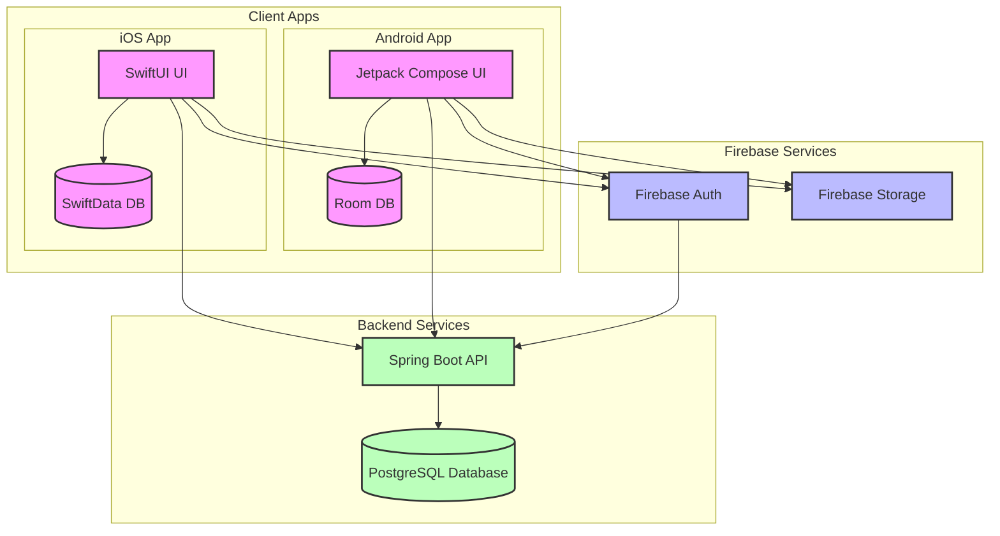
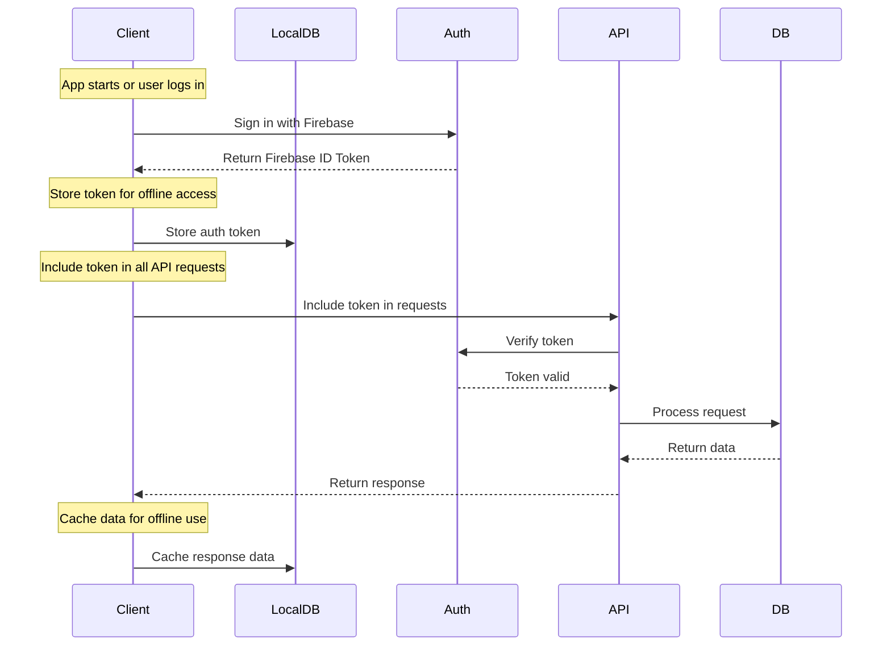
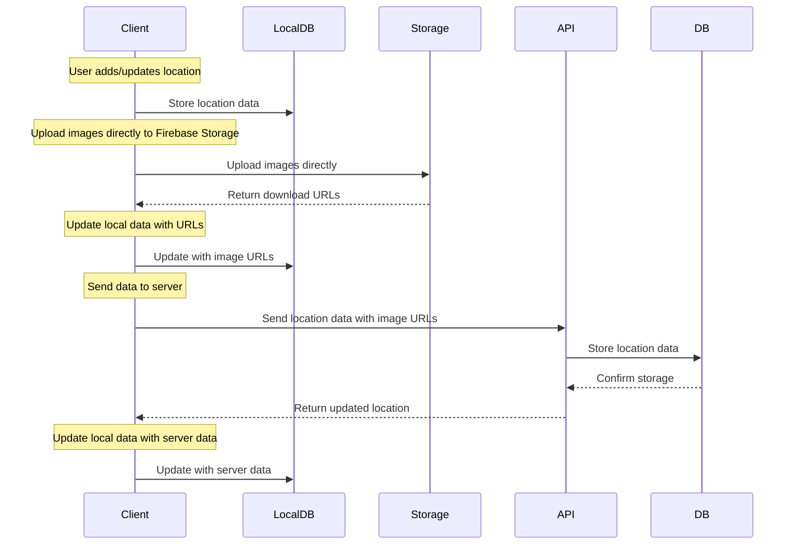
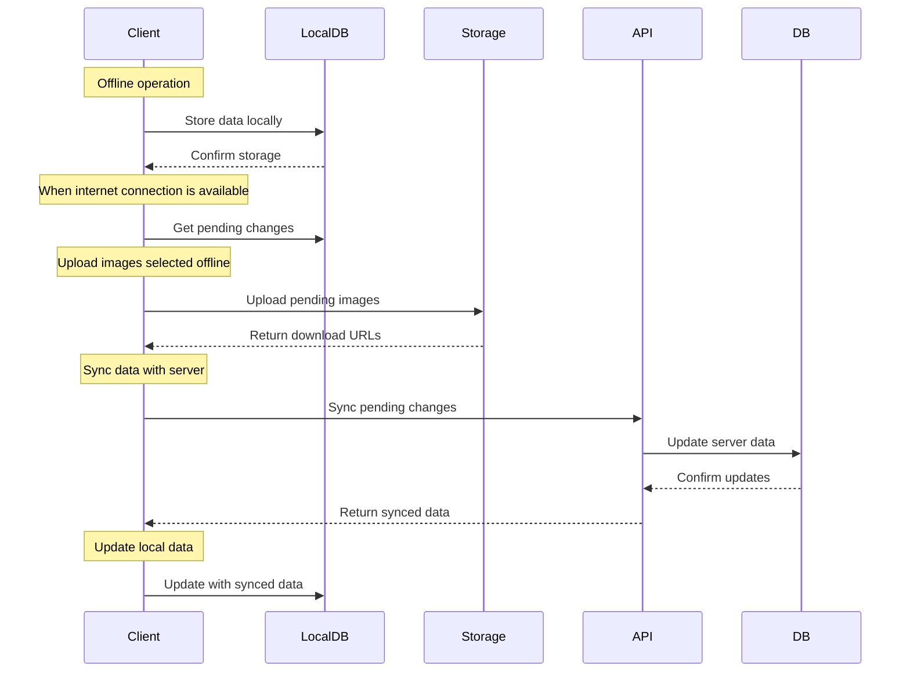
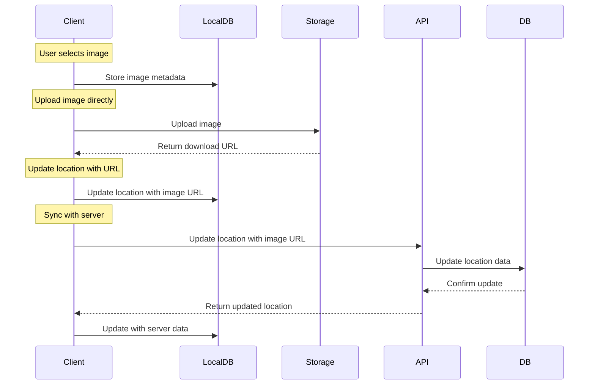

# Locify System Architecture

This document outlines the system architecture of the Locify application, detailing the components, their interactions, and data flows.

## Table of Contents
- [System Architecture](#system-architecture)
  - [Component Details](#component-details)
    - [Client Apps](#1-client-apps)
    - [Firebase Services](#2-firebase-services)
    - [Backend Services](#3-backend-services)
- [Data Flow](#data-flow)
  - [Authentication Flow](#1-authentication-flow)
  - [Data Synchronization Flow](#2-data-synchronization-flow)
  - [Offline Support Flow](#3-offline-support-flow)
  - [Image Handling Flow](#4-image-handling-flow)

---

## System Architecture

## Component Details
### 1. Client Apps
- **iOS App**
  - SwiftUI-based UI
  - SwiftData for local persistence
    - Automatic schema generation
    - CRUD operations
    - Relationship management
    - Offline data sync
  - Firebase SDK integration
  - Direct Firebase Storage access
  - MapKit integration

- **Android App**
  - Jetpack Compose UI
  - Room Database for local persistence
    - Type-safe queries
    - LiveData integration
    - Offline data sync
    - Migration support
  - Firebase SDK integration
  - Direct Firebase Storage access
  - Google Maps integration

### 2. Firebase Services
- **Firebase Auth**
  - User authentication
  - Token generation
  - Session management

- **Firebase Storage**
  - Image storage
  - Direct upload/download
  - Security rules
  - Offline persistence

### 3. Backend Services
- **Spring Boot API**
  - RESTful endpoints
  - Data validation
  - Business logic
  - Firebase token verification
  - Database operations

- **PostgreSQL Database**
  - User data
  - Location data
  - Category data
  - Sync status tracking

## Data Flow
### 1. Authentication Flow

**Notes**:
- Firebase ID Token is stored in local database for offline use
- Token is automatically refreshed when expired
- API response data is cached in local database for offline use
- When offline, app uses cached token and data

### 2. Data Synchronization Flow

**Notes**:
- Data is stored locally before sync
- Images are uploaded directly to Firebase Storage
- Download URLs are stored in local database
- Server data is used to update local data
- If offline, data is marked as pending sync

### 3. Offline Support Flow

**Notes**:
- All offline operations are stored in local database
- When online, app checks and syncs pending changes
- Images are uploaded before data sync
- Server data is used to update local data
- In case of conflicts, server data takes precedence

### 4. Image Handling Flow

**Notes**:
- Images are uploaded directly to Firebase Storage
- Metadata is stored in local database
- Download URL is stored in location data
- If offline, image is marked as pending upload
- When online, pending images are uploaded and synced

---

[Back to Project Overview](../README.md)
