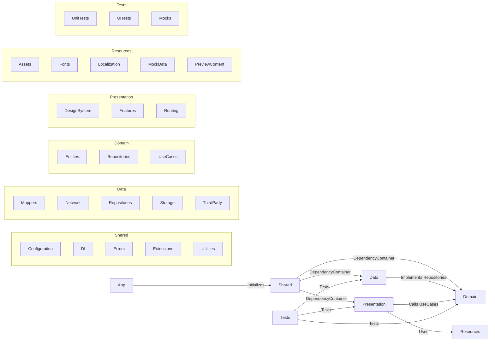

# Locify iOS App

Locify is a location-based application designed for iOS, iPadOS, macOS, and visionOS, enabling users to manage and share favorite places, organize them into categories, and synchronize data seamlessly between offline and online modes. Built with **Clean Architecture**, Locify ensures a modular, testable, and maintainable codebase, leveraging **SwiftUI**, **Firebase**, **Apple Maps (MapKit)**, and **SwiftData** for a robust user experience across all supported platforms.

---

## Table of Contents
- [Features](#features)
- [Requirements](#requirements)
- [Project Structure](#project-structure)

---

## Features
- **Location Management**: Create, edit, and delete favorite locations with details like name, address, coordinates, and images.
- **Category Management**: Organize locations into custom categories for easy access.
- **Main Map**: Interactive map powered by Apple Maps (MapKit) for searching, navigating, and visualizing locations.
- **Authentication**: Secure user authentication via Firebase Authentication, supporting email/password login and registration.
- **Offline/Online Sync**: Store and manage locations and categories offline using SwiftData, with automatic synchronization when online.
- **Settings**: Manage user account, preferences (language, theme), and previews.
- **Multi-platform Support**: Optimized for iOS, iPadOS, macOS, and visionOS with a consistent UI.

---

## Requirements
- **Minimum Deployment Targets**:
  - iOS 26
  - iPadOS 26
  - macOS 26
  - visionOS 26
- **Development Environment**:
  - Xcode 26
  - Swift 6
- **Dependencies**:
  - Firebase (Authentication, Storage) via Swift Package Manager (SPM)

---

## Project Structure
Locify follows **Clean Architecture**, dividing the codebase into **Presentation**, **Domain**, **Data**, and **Shared** layers for separation of concerns. Below is the directory structure, followed by a diagram illustrating the relationships between layers.

### Directory Structure

```
Locify
├── App
├── Data
│   ├── Mappers
│   │   ├── Local
│   │   └── Remote
│   ├── Network
│   │   ├── Base
│   │   ├── Models
│   │   ├── Requests
│   │   └── Services
│   ├── Repositories
│   ├── Storage
│   │   ├── Keychain
│   │   ├── LocalData
│   │   │   ├── SwiftData
│   │   │   └── SyncManager
│   │   ├── Models
│   │   └── UserDefaults
│   └── ThirdParty
│       └── Firebase
│           ├── Authentication
│           └── Storage
├── Domain
│   ├── Entities
│   ├── Repositories
│   └── UseCases
│       ├── Authentication
│       ├── Category
│       ├── Location
│       └── Sync
├── Presentation
│   ├── DesignSystem
│   │   ├── Components
│   │   │   ├── Button
│   │   │   ├── Dialog
│   │   │   ├── Drawer
│   │   │   ├── Image
│   │   │   ├── Map
│   │   │   ├── Text
│   │   │   └── TextField
│   │   └── Styles
│   ├── Features
│   │   ├── Authentication
│   │   │   ├── Views
│   │   │   └── ViewModels
│   │   ├── CategoryManagement
│   │   │   ├── Views
│   │   │   └── ViewModels
│   │   ├── LocationManagement
│   │   │   ├── Views
│   │   │   └── ViewModels
│   │   ├── MainMap
│   │   │   ├── Views
│   │   │   └── ViewModels
│   │   ├── Settings
│   │   │   ├── Views
│   │   │   └── ViewModels
│   │   └── Shared
│   │       ├── Views
│   │       └── ViewModels
│   └── Routing
├── Resources
│   ├── Assets
│   │   ├── Colors
│   │   ├── Icons
│   │   └── Images
│   ├── Fonts
│   ├── Localization
│   │   └── Localized
│   │       └── Keys
│   ├── MockData
│   │   ├── Categories
│   │   ├── Locations
│   │   └── Users
│   └── PreviewContent
├── Shared
│   ├── Configuration
│   ├── DI
│   │   ├── Assemblies
│   │   └── Protocols
│   ├── Errors
│   │   ├── NetworkErrors
│   │   ├── StorageErrors
│   │   └── SyncErrors
│   ├── Extensions
│   │   ├── Foundation
│   │   └── SwiftUI
│   └── Utilities
└── Tests
    ├── UnitTests
    │   ├── Data
    │   ├── Domain
    │   └── Presentation
    ├── UITests
    └── Mocks
```

### Key Components
- **Dependency Injection**: Uses **Assemblies** in `Shared/DI/Assemblies` to register dependencies (UseCases, ViewModels, Repositories) into a custom `DependencyContainer`.
- **Navigation**: Managed directly in SwiftUI Views and ViewModels using `NavigationStack` and `NavigationPath`, with centralized routing in `RouterManager`.
- **Offline Support**: SwiftData handles local storage, with `SyncManager` managing offline/online synchronization (sync_status: synced, pendingCreate, pendingUpdate, pendingDelete).
- **Design System**: Reusable UI components (Button, Map, TextField) in `Presentation/DesignSystem` ensure consistent styling.

### Architecture Diagram
The following diagram illustrates the relationships between directories in Locify's Clean Architecture, highlighting the level-2 directories and how dependencies flow through the `DependencyContainer`.



---

[Back to Project Overview](../README.md)
