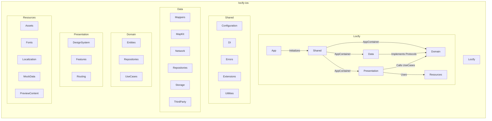

# Locify iOS App

Locify is a location-based application designed for iOS, iPadOS, macOS, and visionOS, enabling users to manage and share favorite places, organize them into categories, and synchronize data seamlessly between offline and online modes without requiring login. Built with **Clean Architecture**, Locify ensures a modular, testable, and maintainable codebase, leveraging **SwiftUI**, **Firebase**, **Google Maps SDK**, **MapKit**, and **SwiftData** for a robust user experience across all supported platforms.

---

## Table of Contents
- [Features](#features)
- [Requirements](#requirements)
- [Project Structure](#project-structure)

---

## Features
- **Location Management**: Create, edit, and delete favorite locations with details like name, address, coordinates, and images (image management requires login).
- **Category Management**: Organize locations into custom or default categories (e.g., Restaurant, Cafe, Favorites) for easy access.
- **Main Map**: Interactive map supporting Google Maps and Apple Maps, with runtime switching via Settings. Features include searching, navigating, and visualizing locations (online only; offline shows last known location).
- **Authentication**: Secure user authentication via Firebase Authentication, supporting email/password login and registration.
- **Offline/Online Sync**: Store and manage locations and categories offline using SwiftData, with automatic synchronization to the server after login when online.
- **Settings**: Manage user account, preferences (language, theme, map provider), and send feedback (online only).
- **Multi-platform Support**: Optimized for iOS, iPadOS, macOS, and visionOS with a consistent SwiftUI-based UI.

---

## Requirements
- **Minimum Deployment Targets**:
  - iOS 26
  - iPadOS 26
  - macOS 26
  - visionOS 26
- **Development Environment**:
  - Xcode 26
  - Swift 6
- **Dependencies**:
  - Firebase (Authentication, Storage) via Swift Package Manager (SPM)
  - Google Maps SDK via SPM
  - MapKit

---

## Project Structure
Locify follows **Clean Architecture**, dividing the codebase into **Presentation**, **Domain**, **Data**, and **Shared** layers for separation of concerns, with dependencies flowing inward to the Domain layer. The structure is designed for testability, modularity, and framework independence, incorporating best practices from top-tier iOS development, such as protocol-based abstractions, fine-grained UseCases, and a robust dependency injection system.

### Directory Structure

```
locify-ios
├── Locify
│   ├── App
│   ├── Data
│   │   ├── Mappers
│   │   │   ├── Local
│   │   │   └── Remote
│   │   ├── MapKit
│   │   ├── Network
│   │   │   ├── Base
│   │   │   ├── Models
│   │   │   ├── Requests
│   │   │   └── Services
│   │   │       ├── AuthService
│   │   │       ├── CategoryService
│   │   │       ├── LocationService
│   │   │       ├── MapService
│   │   │       ├── StorageService
│   │   │       └── SyncService
│   │   ├── Repositories
│   │   │   ├── Authentication
│   │   │   ├── Category
│   │   │   ├── Location
│   │   │   └── Sync
│   │   ├── Storage
│   │   │   ├── Keychain
│   │   │   ├── LocalData
│   │   │   │   ├── SwiftData
│   │   │   │   └── SyncManager
│   │   │   ├── Models
│   │   │   └── UserDefaults
│   │   └── ThirdParty
│   │       ├── Firebase
│   │       │   ├── Authentication
│   │       │   └── Storage
│   │       └── GoogleMaps
│   ├── Domain
│   │   ├── Entities
│   │   ├── Repositories
│   │   └── UseCases
│   │       ├── Authentication
│   │       │   ├── DeleteAccountUseCase
│   │       │   ├── LoginUseCase
│   │       │   ├── LogoutUseCase
│   │       │   └── RegisterUseCase
│   │       ├── Category
│   │       │   ├── CreateCategoryUseCase
│   │       │   ├── DeleteCategoryUseCase
│   │       │   ├── FetchCategoriesUseCase
│   │       │   └── UpdateCategoryUseCase
│   │       ├── Location
│   │       │   ├── CreateLocationUseCase
│   │       │   ├── DeleteLocationUseCase
│   │       │   ├── FetchLocationsUseCase
│   │       │   └── UpdateLocationUseCase
│   │       └── Sync
│   │           ├── ResolveConflictsUseCase
│   │           ├── SyncCategoriesUseCase
│   │           └── SyncLocationsUseCase
│   ├── Presentation
│   │   ├── DesignSystem
│   │   │   ├── Components
│   │   │   │   ├── Button
│   │   │   │   ├── Custom
│   │   │   │   ├── Dialog
│   │   │   │   ├── Image
│   │   │   │   ├── Text
│   │   │   │   └── TextField
│   │   │   └── Styles
│   │   ├── Features
│   │   │   ├── Authentication
│   │   │   │   ├── ViewModels
│   │   │   │   └── Views
│   │   │   ├── CategoryList
│   │   │   │   ├── ViewModels
│   │   │   │   └── Views
│   │   │   ├── LocationList
│   │   │   │   ├── ViewModels
│   │   │   │   └── Views
│   │   │   ├── Home
│   │   │   │   ├── ViewModels
│   │   │   │   └── Views
│   │   │   ├── Settings
│   │   │   │   ├── ViewModels
│   │   │   │   └── Views
│   │   │   └── Shared
│   │   │       ├── ViewModels
│   │   │       └── Views
│   │   └── Routing
│   ├── Resources
│   │   ├── Assets
│   │   │   ├── Colors
│   │   │   ├── Icons
│   │   │   └── Images
│   │   ├── Fonts
│   │   ├── Localization
│   │   │   └── Localized
│   │   │       └── Keys
│   │   ├── MockData
│   │   │   ├── Categories
│   │   │   ├── Locations
│   │   │   └── Users
│   │   └── PreviewContent
│   └── Shared
│       ├── Configuration
│       │   ├── AppConfig
│       │   └── MapProvider
│       ├── DI
│       ├── Errors
│       │   ├── NetworkErrors
│       │   ├── StorageErrors
│       │   └── SyncErrors
│       ├── Extensions
│       │   ├── Foundation
│       │   └── SwiftUI
│       └── Utilities
└── Tests
    ├── Mocks
    │   ├── Repositories
    │   ├── Services
    │   │   ├── MapService
    │   │   └── OtherServices
    │   └── ViewModels
    ├── UITests
    └── UnitTests
        ├── Data
        │   ├── MapKit
        │   ├── Network
        │   ├── Repositories
        │   └── Storage
        ├── Domain
        │   ├── Entities
        │   └── UseCases
        └── Presentation
            ├── Routing
            └── ViewModels
```

### Key Components
- **Dependency Injection**: A custom `AppContainer` in `Shared/DI` serves as the composition root, acting as a singleton factory for creating ViewModels (e.g., `HomeViewModel`, `SettingsViewModel`) and their dependencies, including repositories and use cases, using Swift’s modern concurrency model (`actor`) for thread-safe access. Dependencies (e.g., `MapService`, `SyncService`, `FetchCategoriesUseCase`) are initialized on demand in factory methods to optimize resource efficiency. The container supports a configuration option to toggle between mock and production services (e.g., Firebase, Google Maps) and integrates with SwiftUI using `async` methods for ViewModel creation.
- **Navigation**: Managed in `Presentation/Routing` using `NavigationStack` and `NavigationPath`, with a centralized `Router` for consistent navigation across features.
- **Offline Support**: SwiftData in `Data/Storage/LocalData/SwiftData` handles local storage, with `SyncManager` managing offline/online synchronization using `sync_status` (synced, pendingCreate, pendingUpdate, pendingDelete), as detailed in the [Locify_Data_Sync_Flow.md](./../docs/Locify_Data_Sync_Flow.md). Offline mode displays the last known location on the selected map provider.
- **Design System**: Reusable UI components (e.g., `Button`, `Map`, `TextField`) in `Presentation/DesignSystem/Components` ensure consistent styling across SwiftUI views, with styles defined in `Styles`. Custom components are stored in `Presentation/DesignSystem/Components/Custom` to organize complex or domain-specific UI elements (e.g., `LocationCardView`, `MapPreviewView`, `CategoryTagView`) separately from core components (e.g., `Button`, `Dialog`).
- **Custom Components**: Stored in `Presentation/DesignSystem/Components/Custom` for reusable, cross-feature UI elements, ensuring they are nested below the top-level components to maintain organization and avoid clutter.
- **Repository Protocols**: `Domain/Repositories` defines protocols (e.g., `LocationRepositoryProtocol`) for all repository interactions, implemented in `Data/Repositories`, ensuring decoupling and testability.
- **Service Protocols**: `Data/Network/Services` includes protocols (e.g., `MapServiceProtocol`, `StorageServiceProtocol`) to abstract API requests and map/storage operations. `MapService` supports runtime switching between Google Maps (`Data/ThirdParty/GoogleMaps`) and Apple Maps (`Data/MapKit`) via a factory pattern.
- **API Request Handling**: Services like `LocationService`, `CategoryService`, and `SyncService` handle API requests for their respective domains, as defined in [Locify_API_Documentation.md](./../docs/Locify_API_Documentation.md), while repositories orchestrate network and local storage operations.
- **Map Provider Switching**: Users can switch between Google Maps and Apple Maps in the Settings feature, with the selected provider stored in `Shared/Configuration/MapProvider` using `UserDefaults`. The `MapService` dynamically selects the appropriate implementation (`GoogleMaps` or `MapKit`).
- **Storage Abstraction**: `Data/Network/Services/StorageService` abstracts file storage operations (e.g., image uploads/deletions) via `StorageServiceProtocol`, with the concrete implementation in `Data/ThirdParty/Firebase/Storage` using the Firebase Storage SDK.
- **Testing**: Comprehensive test suites in `Tests/UnitTests` cover `Data` (Repositories, Network, Storage, MapKit), `Domain` (Entities, UseCases), and `Presentation` (ViewModels, Routing), with `Mocks` for repositories, services (including `MapService` for both Google Maps and Apple Maps), and ViewModels in `Tests/Mocks`. `Tests/UITests` validate UI flows, including map provider switching, offline sync, and error handling scenarios.

### Architecture Diagram
The following diagram illustrates the relationships between directories in Locify’s Clean Architecture, highlighting dependency flow through the `AppContainer`.



---

[Back to Project Overview](../README.md)
