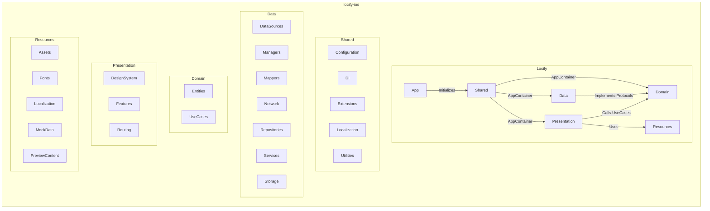

# Locify iOS

Locify is an offline-first location saving app built with SwiftUI and Clean Architecture.
You can create and organize locations into collections while offline using SwiftData, then sync when authenticated and online.

---

## Table of Contents
- [Features](#features)
- [Requirements](#requirements)
- [Project Structure](#project-structure)
- [Key Components](#key-components)
- [Architecture Diagram](#architecture-diagram)
- [Testing](#testing)
- [Documentation](#documentation)

---

## Features
- **Location management**: create, edit, delete saved locations with name/address/coordinates and optional metadata.
- **Collection management**: organize locations into collections (default and custom).
- **Map experience**: browse locations on a map; switch map provider (MapKit / Google Maps) at runtime via Settings.
- **Offline-first**: data is persisted locally using SwiftData; app remains usable without network.
- **Authentication & sync**: login/registration via Firebase Auth; local data syncs with server upon login.
- **Sharing**: share collections and locations with other users (read/edit roles).

---

## Requirements
- Minimum deployment targets:
  - iOS 26+
  - iPadOS 26+
  - macOS 26+
  - visionOS 26+
- Development environment:
  - Xcode 26
  - Swift 6

---

## Project Structure
Locify is organized into 4 layers with dependencies flowing inward:

- Presentation: SwiftUI Views + ViewModels (feature-based).
- Domain: Entities, repository protocols, and UseCases (business logic).
- Data: repository implementations, local storage (SwiftData), and service adapters.
- Shared: DI (AppContainer), configuration, utilities, common errors/extensions.

### Directory overview
```text
locify-ios
├── Locify
│   ├── App
│   ├── Data
│   ├── Domain
│   ├── Presentation
│   ├── Resources
│   └── Shared
└── Tests
```

---

## Key Components
- Dependency Injection: `AppContainer` (actor) acts as the composition root and creates ViewModels and their dependencies.
- UseCase-driven domain: Presentation calls Domain UseCases; Data implements Domain repository protocols.
- Offline-first storage: SwiftData stores collections/locations locally; sync logic (when enabled) coordinates local/remote consistency.
- Map provider abstraction: map interactions are behind protocols/services; provider can be switched in Settings.

---

## Architecture Diagram

```mermaid
graph LR
    A[App] -->|Initializes| B[Shared]
    B -->|AppContainer| C[Domain]
    B -->|AppContainer| D[Data]
    B -->|AppContainer| E[Presentation]
    D -->|Implements Protocols| C
    E -->|Calls UseCases| C
    E -->|Uses| F[Resources]
    subgraph locify-ios
        subgraph Locify
            A
            B
            C
            D
            E
            F
        end
        subgraph Shared
            B1[Configuration]
            B2[DI]
            B3[Extensions]
            B4[Localization]
            B5[Utilities]
        end
        subgraph Data
            D1[DataSources]
            D2[Managers]
            D3[Mappers]
            D4[Network]
            D5[Repositories]
            D6[Services]
            D7[Storage]
        end
        subgraph Domain
            C1[Entities]
            C2[UseCases]
        end
        subgraph Presentation
            E1[DesignSystem]
            E2[Features]
            E3[Routing]
        end
        subgraph Resources
            F1[Assets]
            F2[Fonts]
            F3[Localization]
            F4[MockData]
            F5[PreviewContent]
        end
    end
```

---

## Testing
- Unit tests: UseCases with mocked repositories; Data layer with mocked services/storage.
- ViewModel tests: validate state transitions and outputs.
- UI tests: cover critical user flows where applicable.

---

## Documentation
- **Data Sync Flow**: [Locify_Data_Sync_Flow.md](../docs/Locify_Data_Sync_Flow.md)
- **System Architecture**: [Locify_System_Architecture.md](../docs/Locify_System_Architecture.md)
- **API Documentation**: [Locify_API_Documentation.md](../docs/Locify_API_Documentation.md)
- **Feature Specification**: [Locify_Feature_Specification.md](../docs/Locify_Feature_Specification.md)
- **Database Schema**: [Locify_Database_Schema.md](../docs/Locify_Database_Schema.md)

---

[Back to Project Overview](../README.md)
